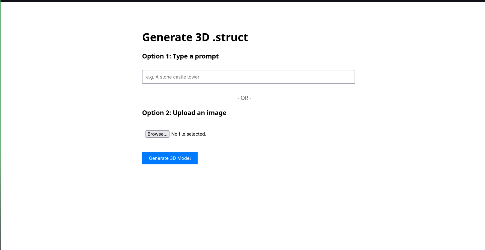
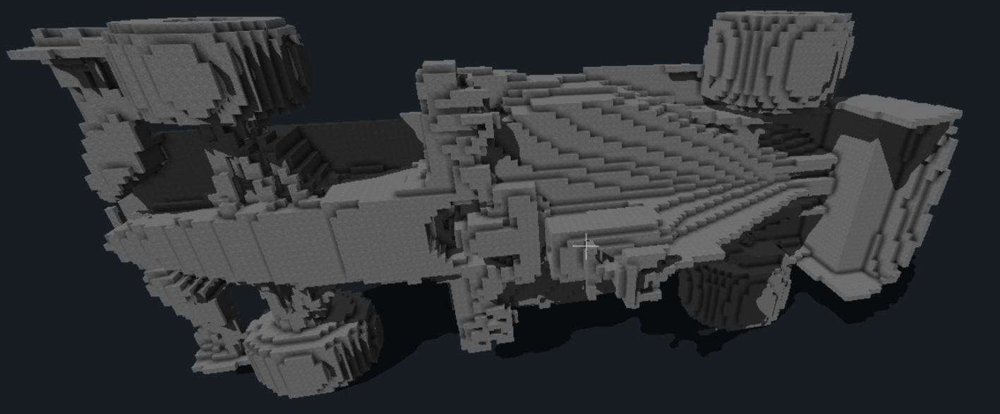

# **minecrafStructureAI**

### **Environment**

First of all, create new python environment: 

```bash
python/python3/py -m venv .venv
source .venv/bin/activate
```

After, install all the dependencies

```bash
which pip

# should tell /path/to/proj/.venv/...

pip install -r requirements.txt
```

You are ready to go)

### **Usage**

Everything you need know about usage is:
1. Source virtual environment with all installed dependencies
2. Simply run ```python app.py``` inside model/

### Important

To use scematics in minecraft, put them to the 
```
~/.minecraft/path/to/version/config/worldedit/schematics
```

## Preview

## **Results**


